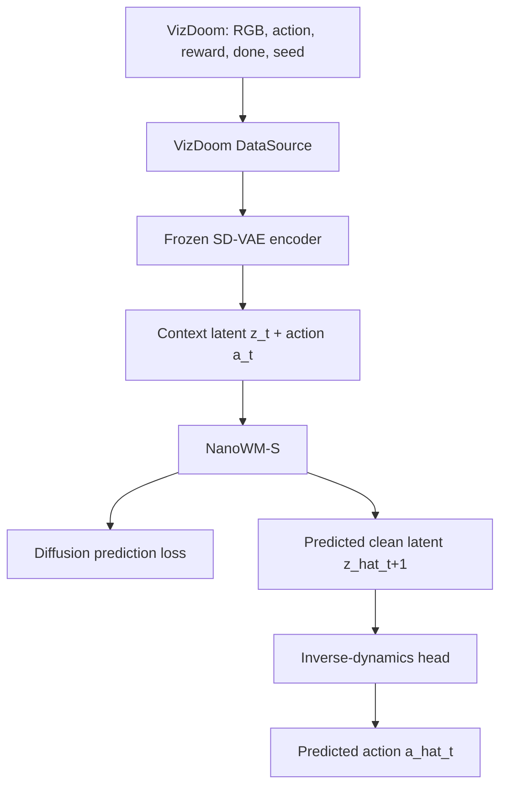
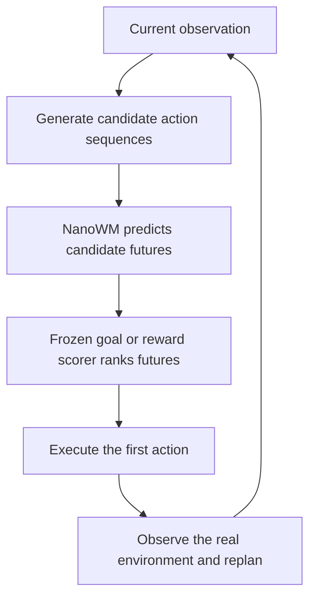
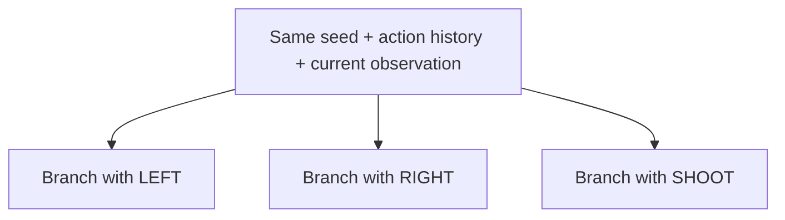

# Action-Aware NanoWM

## Preventing Action-Conditioning Collapse in Low-Compute Game World Models

**Complete project plan**

| Field | Value |
| --- | --- |
| Primary environment | VizDoom Basic |
| Compute target | Google Colab or a personal GPU |
| Recommended duration | 8 weeks |


## 1. Executive Summary

This project studies a specific failure mode exposed by Nano World Models:
a video predictor may generate plausible futures while using very little
information from its action input.

The project will adapt NanoWM-S/2 to the VizDoom Basic environment and add
an inverse-dynamics regularizer that forces predicted state transitions to
reveal the action that caused them. The main scientific question is whether
stronger action sensitivity can be achieved without substantially reducing
video quality, and whether it improves model-predictive planning.

### Core Research Question

Can an auxiliary inverse-dynamics objective make a small diffusion world
model genuinely respond to actions while preserving video quality and
improving planning?

### Primary Outputs

- A self-collected VizDoom dataset containing aligned frames, actions,
  rewards, terminal flags, and environment seeds.
- A standard NanoWM-S baseline.
- An action-aware NanoWM variant with inverse-dynamics regularization.
- A counterfactual benchmark that compares futures generated from the same
  state under different actions.
- A discrete model-predictive-control planner.
- A branching-future interactive demo.
- A Colab notebook, checkpoints, evaluation results, and a 4-6 page
  technical report.

### Project Positioning

A low-compute, reproducible study of action controllability in diffusion
video world models, not a claim of state-of-the-art game-playing performance.


## 2. Research Definition

### Research Questions

- **RQ1.** Does inverse-dynamics regularization increase the measurable
  dependence of future predictions on the action input?

- **RQ2.** Can stronger action sensitivity be achieved without materially
  degrading visual fidelity?

- **RQ3.** Does improved action sensitivity translate into higher planning
  reward or success rate?

### Hypotheses

- **H1.** The action-aware model will produce a larger Action Use Gap than a
  standard additive-action NanoWM baseline.

- **H2.** The action-aware model will achieve higher inverse-action accuracy
  and counterfactual consistency.

- **H3.** The action-aware model will preserve LPIPS within 10 percent of the
  standard baseline.

- **H4.** A planner using the action-aware model will outperform a random
  policy and should improve over the standard NanoWM planner.


## 3. Fixed Project Scope

| Area | Fixed choice |
| --- | --- |
| Primary environment | VizDoom Basic |
| Stretch environment | VizDoom Take Cover |
| World model | NanoWM-S/2, approximately 40 million parameters |
| Latent representation | Frozen Stable Diffusion VAE |
| Input resolution | 256 × 256 after resizing or letterboxing |
| Training sequence | 1 context frame + 3 future frames |
| Action space | 3 discrete actions represented as one-hot vectors |
| Diffusion objective | v-prediction with a cosine noise schedule and zero-terminal SNR |
| Baseline action injection | Additive conditioning |
| Compute constraint | One Colab GPU or one personal GPU |

Actions:

- Move left
- Move right
- Shoot

### Proposed Objective

$$
\mathcal{L}_{\text{total}}
= \mathcal{L}_{\text{diffusion}}
+ \lambda_{\text{action}}\mathcal{L}_{\text{inverse}}.
$$

### Why VizDoom Basic

- The environment has a compact three-action space.
- Episodes are short.
- The terminal objective is clear.
- It is easy to generate action-balanced data.
- It supports a simple discrete planning formulation.
- The visual output makes qualitative results easy to communicate.

### Why Not Use the Official CSGO Dataset

- The NanoWM CSGO dataset is approximately 675 GB.
- The main CSGO checkpoint uses the much larger NanoWM-L/2 model.
- Training and planning would be unnecessarily expensive for a single-GPU
  personal project.


## 4. System Architecture

### Training Pipeline



### Planning Pipeline



### Important Implementation Constraint

The inverse-dynamics head must not receive the action embedding directly.
If it sees the action input, it can learn to copy the conditioning signal
without forcing the predicted future to change.

### Recommended Inverse-Head Inputs

- Context latent z_t
- Predicted next latent z_hat_t+1
- Latent difference z_hat_t+1 - z_t

### Recommended Head

```text
Concatenate latent maps
  → two small convolution layers
  → global average pooling
  → MLP
  → three action logits
```


## 5. Dataset Plan

### Target Size

| Split | Target |
| --- | --- |
| Train | 2,000–3,000 episodes |
| Validation | 200 episodes |
| Test | 200 episodes |
| Counterfactual evaluation | 100–200 fixed starting states |
| Total | Approximately 75,000–150,000 transitions |

### Development Rule

Start with 100 pilot episodes. Do not collect the full dataset until frame
alignment, action alignment, storage format, and DataSource loading have all
been verified.

### Collection Policy Mixture

- 50 percent uniformly random actions for broad coverage.
- 35 percent scripted goal-directed behavior for successful trajectories.
- 15 percent scripted behavior with random perturbations for diverse
  near-success states.

### Scripted Policy Requirements

- Move the monster toward the center of the screen.
- Shoot when the target is sufficiently close to the crosshair.
- Include 10-20 percent random actions to avoid collecting only one narrow
  behavior pattern.

### Frame Processing

- Store frames at a compact native resolution such as 160 x 120.
- Resize or letterbox to 256 x 256 inside the loader.
- Start with frame skip = 4.
- Store raw frames as uint8.
- Cache VAE latents only after the frame pipeline is validated.

### Recommended Episode Format

```text
episode_00001.hdf5
  frames         [T, H, W, 3] uint8
  actions        [T] int64
  action_onehot  [T, 3] float32
  rewards        [T] float32
  dones          [T] bool
  seed           scalar
  success        scalar
```

### Split Policy

- Split by environment seed, not by individual frame.
- Store train, validation, and test seed manifests.
- Never train on counterfactual evaluation branches.
- Use the same fixed validation and test samples for all models.


## 6. Counterfactual Benchmark

The counterfactual set is one of the main project contributions.

For each selected starting state:



If the environment cannot clone its internal state directly:

1. Create three environment instances with the same seed.
2. Replay the same action prefix in all three instances.
3. Verify that the current observations match.
4. Apply a different branch action.
5. Continue each branch for a fixed short horizon.

### Required Counterfactual Outputs

- Real future for each branch.
- Baseline NanoWM prediction for each branch.
- Action-aware NanoWM prediction for each branch.
- Latent and perceptual difference between branches.
- A visual grid and video showing the three futures.


## 7. Codebase Plan

Fork the official NanoWM repository and add:

```text
src/
  wm_datasets/
    data_source/
      game/
        vizdoom.py

  configs/
    dataset/game/vizdoom_basic.yaml
    experiment/vizdoom.yaml
    model/nanowm_s2_vizdoom.yaml

  models/
    action_consistency.py

  evaluation/
    action_use_gap.py
    counterfactual_consistency.py
    long_horizon.py

  planning/
    discrete_mpc.py
    goal_scorer.py

scripts/
  collect_vizdoom.py
  validate_dataset.py
  build_counterfactual_set.py
  train_baseline.sh
  train_action_aware.sh
  render_action_branches.py

demo/
  app.py

reports/
  figures/
  results/
```

### NanoWM Custom Dataset Integration

1. Implement the `DataSource` interface.
2. Register VizDoom in the `DataSource` factory.
3. Add a Hydra dataset configuration.
4. Add an optional environment-specific training configuration.
5. Run with `dataset=game/vizdoom_basic`.


## 8. Training Stages

### Stage 0 — Pipeline Smoke Test

**Dataset:**
- 10-20 episodes
- 32 fixed clips

**Tasks:**

- Verify DataLoader output shapes.
- Verify frame and action alignment.
- Run VAE encode and decode.
- Run model forward and backward passes.
- Overfit 32 clips.
- Save and resume a checkpoint.
- Render ground truth versus predicted clips.

**Exit condition:**

- The model can overfit the small clip set.
- Checkpoint resume produces a valid continuation.
- Generated frames contain motion rather than only copying the context.


### Stage 1 — Action-Agnostic Sanity Baseline

Run evaluation with:

- Zero actions
- Shuffled actions
- Correct actions

**Purpose:**

- Establish the action-agnostic lower bound.
- Determine how well the model can predict an average future.
- Verify that the dataset contains action-dependent visual changes.


### Stage 2 — Standard NanoWM Baseline

**Configuration:**

- NanoWM-S/2
- v-prediction
- cosine schedule + zero-terminal SNR
- additive action injection
- 1 context + 3 future frames
- lambda_action = 0

**Development run:**
- 10,000-20,000 steps

**Potential final run:**
- 30,000-50,000 steps

**Exit condition:**

- The model beats copy-last-frame at one-step prediction.
- Validation LPIPS is stable.
- Qualitative futures show correct scene motion.


### Stage 3 — Action-Aware NanoWM

**Procedure:**

1. Recover the predicted clean latent from the v-prediction output.
2. Construct the inverse-head input from the predicted transition.
3. Predict the corresponding discrete action.
4. Add class-balanced cross-entropy to the diffusion loss.

**Loss:**

$$
\mathcal{L}_{\text{total}}
= \mathcal{L}_{\text{diffusion}}
+ \lambda_{\text{action}}\operatorname{CrossEntropy}(\hat{a}, a).
$$

**Initial lambda sweep:**

- 0.05
- 0.10
- 0.25

**Training stabilization:**

- Begin with 1,000-2,000 diffusion-only warm-up steps.
- Increase lambda_action gradually.
- Apply the auxiliary loss only when the reconstructed clean latent is
  sufficiently informative.
- Optionally SNR-weight or mask extremely noisy timesteps.

**Exit condition:**

- Inverse-action accuracy exceeds the 33.3 percent random baseline.
- Correct-action predictions differ measurably from shuffled-action
  predictions.


### Stage 4 — Final Runs

**Development:**

- Use one seed for each lambda configuration.
- Stop clearly poor configurations early.

**Final comparison:**

- Standard additive NanoWM: 3 seeds.
- Best action-aware NanoWM: 3 seeds.

Do not run three seeds for the entire lambda sweep.


## 9. Experimental Matrix

| ID | Model | Action input | Auxiliary objective | Priority |
| --- | --- | --- | --- | --- |
| E0 | Copy-last-frame | None | None | Required |
| E1 | NanoWM action-agnostic | Zero or shuffled | None | Required |
| E2 | NanoWM additive baseline | Correct | None | Required |
| E3 | NanoWM additive | Correct | Inverse dynamics, $\lambda=0.05$ | Required |
| E4 | NanoWM additive | Correct | Inverse dynamics, $\lambda=0.10$ | Required |
| E5 | NanoWM additive | Correct | Inverse dynamics, $\lambda=0.25$ | If compute allows |
| E6 | NanoWM FiLM | Correct | Best inverse-dynamics setting | Stretch |

### Controlled Variables

- Model size
- VAE checkpoint
- Dataset and split
- Training steps
- Optimizer and learning rate
- Diffusion target
- Noise schedule
- Sampling steps
- Evaluation samples
- Random seeds used for final runs


## 10. Evaluation Framework

### A. Visual Fidelity

**Metrics:**

- PSNR, higher is better
- SSIM, higher is better
- LPIPS, lower is better

**Compare:**

- Copy-last-frame
- Action-agnostic NanoWM
- Standard additive NanoWM
- Action-aware NanoWM

Report both one-step and three-step predictions.

FID is optional because a small game dataset may produce unstable or
misleading distributional estimates.


### B. Action Use Gap

This is the primary metric.

$$
\operatorname{AUG}
= \mathbb{E}[d(\hat{x}_{\text{shuffled}}, x)]
- \mathbb{E}[d(\hat{x}_{\text{correct}}, x)].
$$

**Possible distance functions:**

- LPIPS
- VAE latent MSE

**Interpretation:**

- AUG approximately zero: changing the action has little effect on
  prediction accuracy.
- Positive AUG: the correct action is informative.
- Larger proposed-model AUG: the auxiliary objective improves action use.

**Report:**

- Mean AUG
- Standard deviation
- Bootstrap confidence interval
- AUG by action class
- AUG by prediction horizon


### C. Inverse-Action Accuracy

**Metrics:**

- Overall accuracy
- Per-action precision and recall
- Confusion matrix
- Random baseline: 33.3 percent

Shoot may be visually ambiguous when the shot misses or produces little
immediate state change. Therefore, always report per-class performance.


### D. Counterfactual Action Consistency

For two actions a_i and a_j:

$$
\Delta z_{\text{true}} = z_{t+1}(a_i) - z_{t+1}(a_j)
$$

$$
\Delta z_{\text{pred}} = \hat{z}_{t+1}(a_i) - \hat{z}_{t+1}(a_j).
$$

**Metrics:**

- Cosine similarity between true and predicted latent differences
- Relative magnitude error
- LPIPS between real branches
- LPIPS between predicted branches

High output diversity is not automatically good. The predicted branch
difference must match the direction and magnitude of the real action effect.


### E. Long-Horizon Drift

**Evaluate rollout lengths:**

- 1 step
- 3 steps
- 6 steps
- 12 steps
- 24 steps

**Report:**

- LPIPS versus rollout step
- Action accuracy versus rollout step
- Correct-action versus shuffled-action gap versus rollout step
- Qualitative rollout videos
- The first horizon at which scene geometry, monster state, or action effects
  become unreliable


### F. Planning

**Metrics:**

- Average episode return
- Kill or success rate
- Average number of shots
- Average episode length
- Planning latency per action

**Baselines:**

- Random policy
- Scripted policy
- Standard NanoWM planner
- Action-aware NanoWM planner


## 11. Discrete Model-Predictive Planning

### MVP Planner: Exhaustive Discrete MPC

With three actions and horizon four:

$$3^4 = 81 \text{ candidate action sequences}.$$

**Procedure:**

1. Encode the current observation.
2. Enumerate all 81 candidate action sequences.
3. Predict their future latent trajectories.
4. Score candidate futures.
5. Select the highest-scoring sequence.
6. Execute only the first action.
7. Observe the real environment.
8. Replan.

**Initial planner configuration:**

- Horizon: 4
- Candidates: 81
- DDIM steps: 10 during development
- Scheduling: full sequence
- Candidate chunk size: 9-27 depending on GPU memory
- Replan frequency: after every real action

### Goal or Reward Scorer

Train a small scorer on real VAE latents to estimate:

- Probability that the monster is killed
- Short-horizon reward
- Optional shot penalty

**Example planning objective:**

$$
J = P(\text{kill}) - \beta \cdot \text{number of shots}.
$$

The scorer should be frozen before planner comparison. Both standard and
action-aware world models must use exactly the same scorer.

### Stretch Planner: Categorical CEM

**Suggested configuration:**

- Horizon: 6
- Samples per iteration: 64
- Elites: 8
- Optimization iterations: 5
- Update categorical action probabilities from elite frequencies
- Execute one action, then replan


## 12. Compute Plan

### Initial Colab T4 Configuration

- Model: NanoWM-S/2
- Batch size: 1
- Gradient accumulation: 8-16
- Precision: FP16
- Frames: 4 total
- Resolution: 256 x 256
- Development validation samples: 64
- Development DDIM steps: 10
- Final DDIM steps: 20-50

### Out-of-Memory Fallback Order

1. Keep batch size at one and increase gradient accumulation.
2. Enable gradient checkpointing if required.
3. Cache frozen VAE latents.
4. Reduce model depth or width to a 15M-25M NanoWM-XS configuration.
5. Reduce validation size.
6. Disable expensive distributional metrics during training.

### Storage Estimate

- Raw compressed dataset: 3-10 GB
- Cached latents: 1-5 GB
- Checkpoints, logs, and videos: 5-15 GB
- Recommended total Google Drive space: 20-30 GB

### Colab Workflow

- Keep the master dataset and checkpoints on Google Drive.
- Copy the active data shard to local Colab storage before training.
- Save a checkpoint every 1,000-2,000 steps.
- Store the complete resolved Hydra configuration with every run.
- Test resume behavior during the first week.

### Dependency Policy

- Begin with the official NanoWM environment file.
- Pin PyTorch and related libraries.
- Do not upgrade dependencies until the baseline pipeline runs.
- Treat checkpoint files as trusted inputs only when loading with relaxed
  PyTorch weights-only settings.


## 13. Eight-Week Execution Timeline

### Week 1 — Environment and Data

**Tasks:**

- Fork NanoWM.
- Create the Colab environment.
- Install VizDoom.
- Collect 100 pilot episodes.
- Implement the episode format.
- Visualize frame sequences and action distributions.
- Verify frame-action alignment.
- Implement VizDoomDataSource.

**Deliverables:**

- collect_vizdoom.py
- vizdoom.py
- pilot dataset
- dataset visualization notebook

**Exit gate:**

A DataLoader batch returns one context frame, three future frames, and the
correct aligned action sequence.


### Week 2 — Baseline Pipeline

**Tasks:**

- Run VAE encode and decode.
- Overfit 32 clips.
- Implement copy-last-frame baseline.
- Implement zero-action and shuffled-action evaluation.
- Train a 5,000-10,000-step NanoWM development baseline.
- Render correct-action and shuffled-action futures.

**Deliverables:**

- Initial baseline checkpoint
- GT-versus-prediction video
- Smoke-test metrics

**Exit gate:**

The model beats copy-last-frame at one-step prediction.


### Week 3 — Full Standard NanoWM

**Tasks:**

- Collect 75,000-150,000 transitions.
- Finalize train, validation, and test seed manifests.
- Train the standard NanoWM baseline for 20,000-30,000 steps.
- Establish a fixed evaluation set.
- Log PSNR, SSIM, LPIPS, and Action Use Gap.

**Deliverables:**

- Full dataset
- Standard baseline checkpoint
- Fixed benchmark JSON
- Training report

**Exit gate:**

Validation LPIPS is stable and qualitative futures show meaningful motion.


### Week 4 — Action-Aware Method

**Tasks:**

- Implement clean-latent recovery from v-prediction.
- Implement the inverse-dynamics head.
- Add lambda and warm-up configurations.
- Verify that the head cannot access the action embedding.
- Overfit an action-balanced clip set.
- Run the lambda sweep.

**Deliverables:**

- Action-aware model code
- Lambda ablation results
- Action confusion matrix

**Exit gate:**

Inverse-action accuracy exceeds 33.3 percent.


### Week 5 — Core Final Experiments

**Tasks:**

- Select the best lambda.
- Train the final standard and proposed models.
- Run three final seeds for both models.
- Evaluate visual quality.
- Evaluate correct, zero, and shuffled actions.
- Compute bootstrap confidence intervals.

**Deliverables:**

- Final comparison table
- Main statistical plots
- Best checkpoints

**Exit gate:**

The proposed model improves action sensitivity while increasing LPIPS by no
more than 10 percent.


### Week 6 — Counterfactual Benchmark

**Tasks:**

- Build 100-200 paired branching states.
- Run LEFT, RIGHT, and SHOOT predictions.
- Compute counterfactual consistency.
- Render branching videos.
- Analyze success and failure cases.

**Deliverables:**

- Counterfactual dataset
- Counterfactual Action Consistency metric
- Qualitative comparison grid

**Exit gate:**

Predicted action deltas correlate with real action deltas better than the
standard NanoWM baseline.


### Week 7 — Planning

**Tasks:**

- Train the frozen goal or reward scorer.
- Implement exhaustive discrete MPC.
- Evaluate random, scripted, standard NanoWM, and action-aware planners.
- Measure planning latency.
- Add categorical CEM only if time permits.

**Deliverables:**

- Planning results JSON
- Episode videos
- Planner benchmark table

**Exit gate:**

The proposed planner beats the random policy. The target result is also an
improvement over the standard NanoWM planner.


### Week 8 — Demo and Release

**Tasks:**

- Build the branching-future demo.
- Clean the Colab notebook.
- Write exact reproduction commands.
- Release dataset split metadata.
- Upload final checkpoints.
- Write the technical report.
- Record a 60-90 second demonstration video.

**Deliverables:**

- Public GitHub repository
- Colab notebook
- Interactive demo
- Checkpoints
- Evaluation results
- Technical report

**Exit gate:**

Another researcher can reproduce the main prediction, action-sensitivity,
and planning results on one accessible GPU.


## 14. Success Criteria

### Minimum Credible Result

- Reproducible VizDoom dataset and NanoWM DataSource.
- Trained standard NanoWM-S baseline.
- Trained action-aware variant.
- Proposed model has a larger Action Use Gap.
- Proposed model's LPIPS is no more than 10 percent worse.
- Counterfactual branch demo is complete.
- At least one planning experiment or a rigorous planning failure analysis
  is reported.

### Target Result

- Inverse-action accuracy of at least 60 percent.
- Positive Action Use Gap with a confidence interval that excludes zero.
- At least 20 percent relative improvement in counterfactual consistency.
- At least 10 percentage points of planning-success improvement over the
  standard NanoWM planner.

### Strong Research Result

- Visual quality remains close to the standard baseline.
- Action sensitivity improves at both short and long horizons.
- Planning improvement is consistent across three seeds.
- The main result transfers from VizDoom Basic to Take Cover.


## 15. Risk Management

| Risk | Early signal | Mitigation |
| --- | --- | --- |
| GPU out of memory | Batch size one cannot complete a forward pass | Use NanoWM-XS, cache latents, checkpoint activations, and reduce validation workload |
| Model copies the current frame | PSNR is acceptable, but motion is incorrect | Increase frame skip and balance action transitions |
| Model ignores actions | Correct and shuffled actions produce nearly identical futures | Add inverse-dynamics regularization and test FiLM as a stretch ablation |
| Action head learns a shortcut | Action accuracy is high, but predicted video does not change | Never provide the action embedding directly to the inverse head |
| SHOOT action is visually ambiguous | Shoot recall remains low while movement actions are accurate | Report per-class results and increase successful-shot data |
| Dataset contains few successful episodes | The reward scorer predicts only one class | Increase the percentage of scripted successful trajectories |
| Diffusion planning is too slow | One environment action requires several minutes | Use 10 DDIM steps, full-sequence scheduling, candidate chunking, and exact horizon-four enumeration |
| Planner scorer fails | Scorer performs poorly even on real validation latents | Validate and freeze the scorer before testing world-model planning |
| Planning does not improve | Proposed planner reward remains near random | Center the final contribution on action collapse and the counterfactual benchmark; report planning as a limitation |
| Colab disconnects | Long training sessions are lost | Save checkpoints frequently and verify resume behavior early |


## 16. Deliverables and Impact

### Repository

- Dataset collector
- NanoWM DataSource
- Action-aware model
- Evaluation metrics
- Discrete planner
- Demo source code

### Dataset

- Episode files
- Train, validation, and test seed manifests
- Counterfactual branch metadata
- Data collection documentation

### Models

- Standard NanoWM checkpoint
- Action-aware NanoWM checkpoint
- Frozen goal or reward scorer
- Complete resolved configuration files

### Evaluation

- JSON metric outputs
- Confidence intervals
- Confusion matrices
- Long-horizon curves
- Counterfactual comparison grids
- Planning videos

### Demo

- Select a starting game state.
- Choose an action or action sequence.
- View predicted future branches.
- Show the planner-selected action.

### Report

- 4-6 pages
- Motivation
- Related work
- Method
- Dataset
- Experiments
- Results
- Limitations
- Failure cases
- Future work

### Impact Statement

Existing video world models are often evaluated primarily by visual fidelity.
This project introduces a low-compute benchmark for testing whether visually
plausible predictions actually respond correctly to actions.

### Potential Contributions

1. **Dataset contribution:** an action-aligned and counterfactual VizDoom
   benchmark.

2. **Method contribution:** inverse-dynamics regularization for a diffusion
   video world model.

3. **Evaluation contribution:** Action Use Gap and Counterfactual Action
   Consistency in addition to traditional visual metrics.

### Recommended Final Report Title

*Action-Aware NanoWM: Measuring and Preventing Action Collapse in Low-Compute
Game World Models*


## 17. First 72 Hours

### Day 1

- Fork NanoWM.
- Create the Colab environment.
- Pin dependencies.
- Run a configuration and import smoke test.
- Install VizDoom.
- Launch VizDoom Basic.
- Collect 10 episodes.

**Required output:**

- Working environment
- Raw pilot episodes
- One rendered episode video


### Day 2

- Save frames, actions, rewards, terminal flags, and seeds.
- Plot three random episodes.
- Check action balance.
- Verify that action a_t maps frame o_t to frame o_t+1.
- Implement VizDoomDataSource.
- Load one four-frame batch.

**Required output:**

- Verified DataLoader batch
- Dataset visualization
- Action distribution plot


### Day 3

- Run VAE encode and decode.
- Overfit 32 clips for 500-1,000 steps.
- Render ground truth versus prediction.
- Save a checkpoint.
- Restart the runtime and resume training.

**Required output:**

- GT-versus-prediction video
- Resumable checkpoint
- Initial training log


Do not collect the full dataset or run 30,000 training steps before all three
days of the kickoff checklist have passed.


## 18. Definition of Done

The project is complete when another researcher can:

1. Clone the repository.
2. Load the published VizDoom split or collect a compatible sample.
3. Load the standard and action-aware checkpoints.
4. Reproduce the main visual-quality metrics.
5. Reproduce the Action Use Gap and counterfactual results.
6. Run the discrete planner.
7. Generate the branching-future demo.
8. Complete the workflow on one accessible GPU.


## Primary References

- [Nano World Models paper](https://arxiv.org/abs/2605.23993)
- [NanoWM official repository](https://github.com/simchowitzlabpublic/nano-world-model)
- [NanoWM configuration guide](https://github.com/simchowitzlabpublic/nano-world-model/blob/main/docs/config_system.md)
- [NanoWM dataset guide](https://github.com/simchowitzlabpublic/nano-world-model/blob/main/docs/datasets/README.md)
- [NanoWM planning guide](https://github.com/simchowitzlabpublic/nano-world-model/blob/main/docs/applications/planning.md)
- [ViZDoom official documentation](https://vizdoom.farama.org/)
- [VizDoom default environments](https://vizdoom.farama.org/environments/default/)
- [ViZDoom official repository](https://github.com/Farama-Foundation/ViZDoom)
